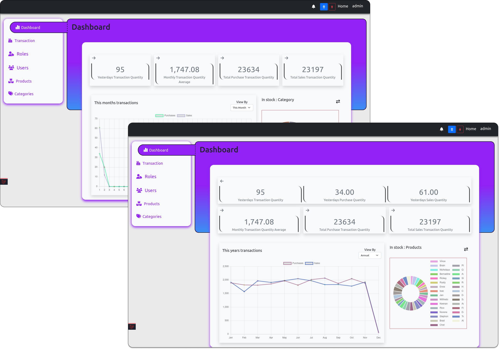
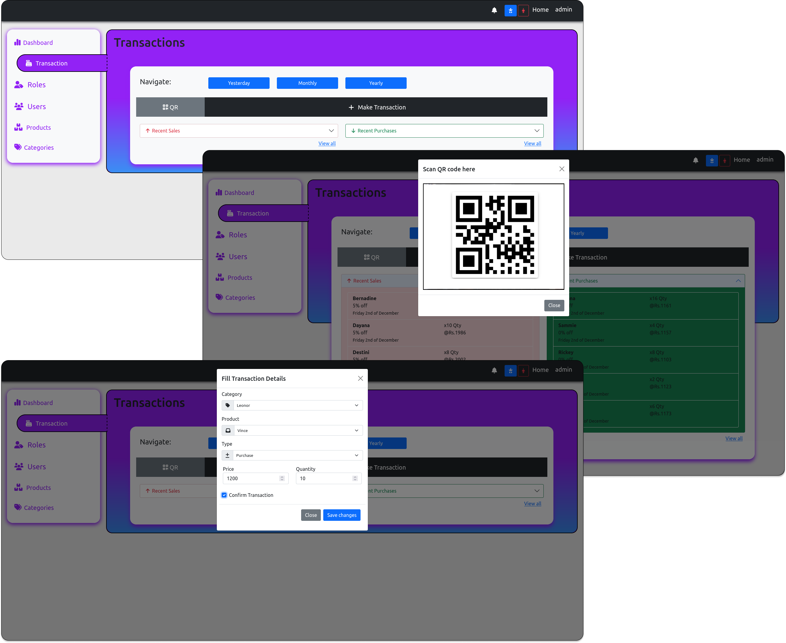
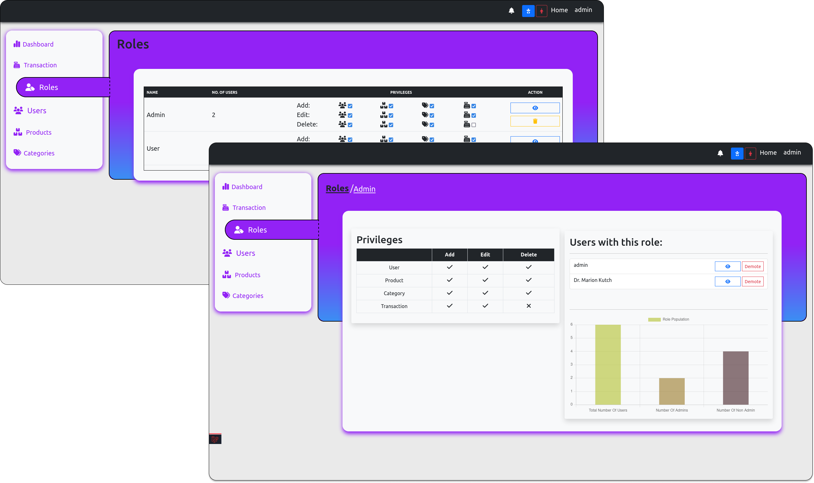
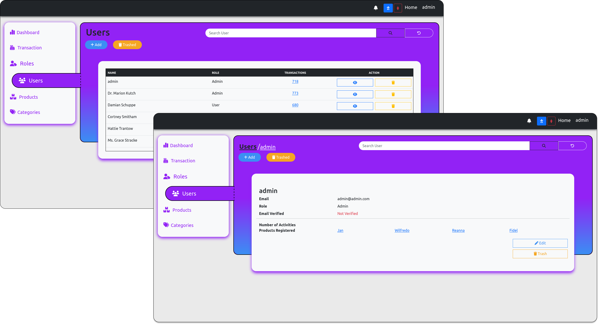
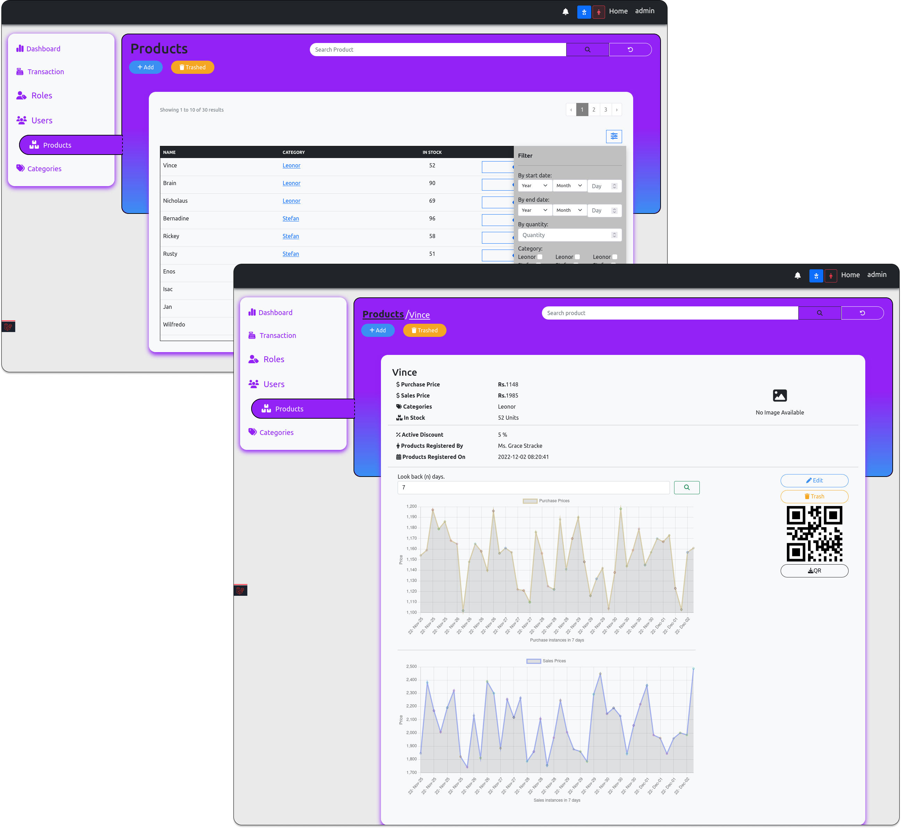
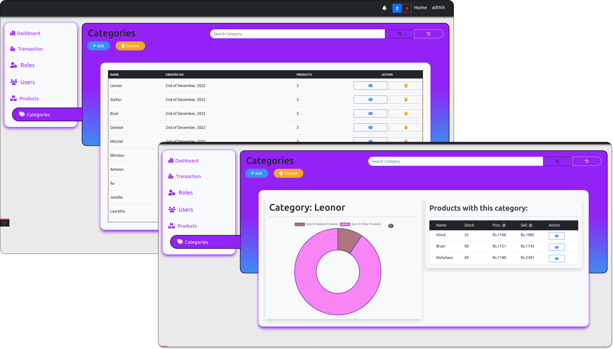
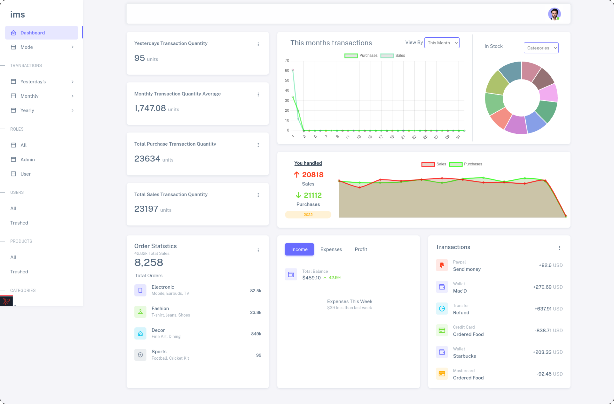

# Getting Started
- Download or git clone this repository
- cd into Laravel-Inventory directory

 ## Install necessary packages using Composer
   ``` 
     composer install --ignore-platform-req=ext-cassandra
   ```
   ```
     composer update --ignore-platform-req=ext-cassandra
   ```
 ## Generate .env file
   - Rename the .env.example file to .env
   - or run
     ```
       cp .env.example .env
     ```
     
 ## Generate APP_KEY for .env
   ```
     php artisan key:generate
   ```
 
 ## Configure the .env file
   - On line-14 : Fill {database_name} 
   - On line-15 : Fill {database_user}
   - On line-16 : Fill {user_password}
 ## Run migrations
   ```
     php artisan migrate
   ```
 ## Generate Admin account
   ```
     php artisan db:seed
   ```
   - this generates admin credentials 
     - email: admin@admin.com
     - password: admin123
 
 ## Create Symlink
   ```
     php artisan storage:link
   ```
 
 ## Running the application
   ```
     php artisan serve
   ```
--- 
   > ### Note:
   >
   > For sail: run the following commands
   > - ```sail artisan migrate ```
   > - ```sail artisan db:seed```
   > - ```sail artisan storage:link```
   > - ```sail up```
--- 
# Accessing the application
## Login credentials
  - email: admin@admin.com
  - password: admin123

# Screenshots
## Casual
### Dashboard

### Transactions

### Roles

### Users

### Products

### Categories


## Premium
### Dashboard

